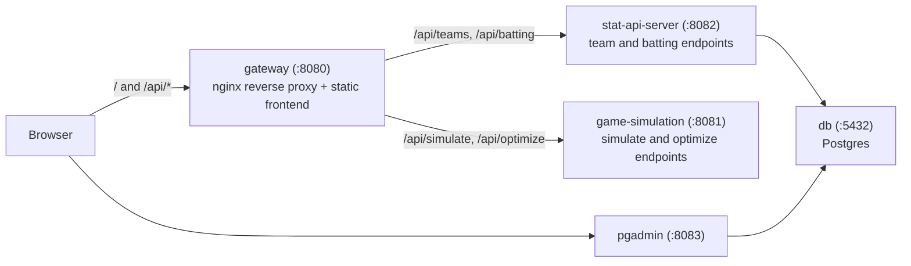

# Lineup Lab

Lineup Lab is a microservice-style baseball lineup simulator built to practice Go backend development, React frontend work, Docker-based local environments, and Kubernetes-oriented operational patterns.

## Local Architecture

The local Docker Compose stack has five services:

- `gateway`
  - browser-facing reverse proxy on `http://localhost:8080`
  - serves the built frontend and exposes the single public `/api` surface
- `stat-api-server`
  - Go API for roster and batting data on `http://localhost:8082`
- `game-simulation`
  - Go API for lineup simulation and optimization on `http://localhost:8081`
- `db`
  - Postgres database on `localhost:5432`
- `pgadmin`
  - Database admin UI on `http://localhost:8083`

### Architecture Diagram



Production-style local request flow:

1. The browser talks only to the gateway origin at `http://localhost:8080`
2. nginx in the gateway routes `/api/teams` and `/api/batting` to `stat-api-server`
3. nginx in the gateway routes `/api/simulate` and `/api/optimize` to `game-simulation`
4. `stat-api-server` reads batting data from Postgres
5. `pgadmin` remains a separate local admin UI on `http://localhost:8083`

## Local Development

### 1. Create a local env file

Copy the example env file:

```sh
cp .env.example .env
```

The default `.env.example` values are set up for local development, but you should still update placeholder credentials such as:

- `POSTGRES_PASSWORD`
- `PGADMIN_DEFAULT_PASSWORD`
- `STAT_API_SERVER_DATABASE_URL`

If you change the database credentials, keep `STAT_API_SERVER_DATABASE_URL` in sync with them.

### 2. Start the stack with Docker Compose

```sh
docker compose up --build
```

This starts the full local environment with the gateway, both Go services, Postgres, and pgAdmin.

### 3. Open the app

- gateway and frontend app: [http://localhost:8080](http://localhost:8080)
- stat API: [http://localhost:8082/teams](http://localhost:8082/teams)
- simulation API: [http://localhost:8081/healthz](http://localhost:8081/healthz)
- pgAdmin: [http://localhost:8083](http://localhost:8083)

## Configuration

Key local environment variables:

### Database

- `POSTGRES_DB`
- `POSTGRES_USER`
- `POSTGRES_PASSWORD`
- `STAT_API_SERVER_DATABASE_URL`

### Service ports

- `STAT_API_SERVER_PORT`
- `STAT_API_SERVER_HOST_PORT`
- `GAME_SIMULATION_PORT`
- `GAME_SIMULATION_HOST_PORT`

### Service behavior

- `STAT_API_SERVER_ALLOWED_ORIGIN`
- `GAME_SIMULATION_ALLOWED_ORIGIN`
- `GAME_SIMULATION_DEBUG`

### Database admin

- `PGADMIN_DEFAULT_EMAIL`
- `PGADMIN_DEFAULT_PASSWORD`

Notes:

- `docker-compose.yml` requires several env vars explicitly and fails fast if they are missing
- the browser only talks to the gateway origin in Docker Compose; the gateway routes `/api/*` to the internal backend services
- the frontend source lives in `frontend/`, but the runtime entrypoint is the `gateway` service

## Health And Readiness Endpoints

Both Go services expose Kubernetes-friendly probe endpoints:

### `game-simulation`

- `GET /healthz`
- `GET /readyz`

Both return `200 OK` when the process is available.

### `stat-api-server`

- `GET /healthz`
- `GET /readyz`

`/readyz` is backed by a database ping, so it returns success only when the API can reach Postgres.

## Validation And Safety Checks

The simulator now performs stricter input validation:

- rejects malformed JSON
- rejects unknown JSON fields
- rejects duplicate batter names
- rejects invalid stat combinations such as `hit > at_bat`

This protects the service from obviously invalid simulation input and makes the API behavior easier to reason about.

## CI

Current GitHub Actions coverage includes:

- Compose configuration validation
  - verifies default and overridden local port/env wiring
  - verifies required env vars fail fast
- Go static checks
  - `gofmt`
  - `go vet`
  - `golangci-lint`
- Per-service coverage reporting
  - `game-simulation`
  - `stat-api-server`
  - `frontend`
- Frontend build validation
  - `vite build`

The project reports per-service coverage instead of relying on a single overall percentage, because the frontend and the Go services have different testing surfaces and responsibilities.

## Running Coverage Locally

### `game-simulation`

```sh
cd game-simulation
go test ./... -coverprofile=coverage.out
go tool cover -func=coverage.out
```

### `stat-api-server`

```sh
cd stat-api-server
go test ./... -coverprofile=coverage.out
go tool cover -func=coverage.out
```

### `frontend`

```sh
cd frontend
npm run test:coverage
```

The frontend coverage summary is written to `frontend/coverage/coverage-summary.json`, and the HTML report is generated under `frontend/coverage/`.

## Repository Pointers

- frontend app: [frontend/README.md](frontend/README.md)
- local env template: [.env.example](.env.example)
- contributor workflow: [CONTRIBUTING.md](CONTRIBUTING.md)
