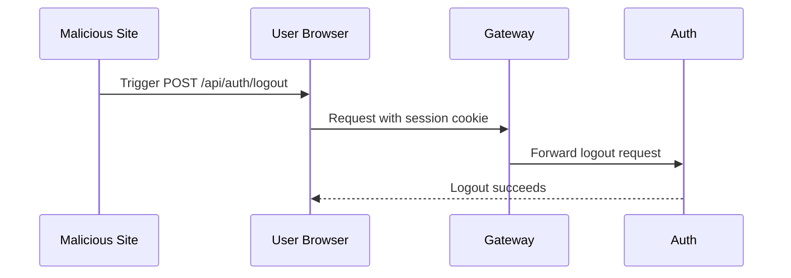
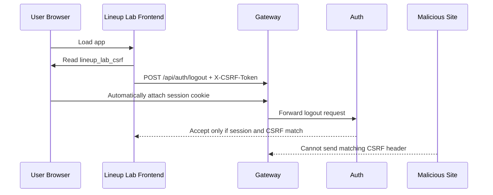

# Auth Session Strategy

This document defines the session cookie and CSRF design for gateway-routed auth under `#95`.

## Summary

- browser traffic stays same-origin through the gateway
- auth uses a server-side session, not a frontend-managed bearer token
- the browser gets two cookies:
  - `lineup_lab_session`: opaque session ID, `HttpOnly`
  - `lineup_lab_csrf`: readable CSRF token for frontend use
- state-changing authenticated requests must include `X-CSRF-Token`

## Public Routing Model

The browser should talk only to the gateway origin.

- local origin: `http://localhost:8080`
- auth routes: `/api/auth/*`
- current-user route: `/api/users/*`
- auth service remains internal to the Compose or cluster network

This keeps auth same-origin and avoids browser-managed cross-origin complexity.

## Cookie Policy

Recommended cookies:

- `lineup_lab_session`
  - opaque session identifier
  - `HttpOnly=true`
  - `Path=/`
  - `SameSite=Lax`
  - `Secure=false` locally, `true` in production
  - `Max-Age=1209600` (14 days) by default, unless product requirements prefer browser-session-only login
  - no `Domain` by default
- `lineup_lab_csrf`
  - readable CSRF token
  - `HttpOnly=false`
  - `Path=/`
  - `SameSite=Lax`
  - `Secure=false` locally, `true` in production
  - lifetime should not exceed the active session lifetime
  - no `Domain` by default

Why these defaults:

- `HttpOnly` protects the session cookie from frontend JavaScript
- `SameSite=Lax` is a good default for a same-origin browser app
- `Secure=true` should be required in HTTPS deployments
- host-only cookies keep the scope tight unless cross-subdomain sharing is truly needed

## CSRF Model

CSRF matters because browsers send cookies automatically. Without an extra check, a third-party site may be able to trigger a state-changing request that still carries the victim's valid session cookie.

Recommended flow:

- login creates both the session cookie and the CSRF cookie
- frontend reads `lineup_lab_csrf`
- frontend sends that value in `X-CSRF-Token`
- auth service validates the header against the active session

Require CSRF validation for:

- `POST /api/auth/logout`
- future authenticated mutating routes

Do not require CSRF validation for:

- `GET` and other safe read-only requests
- the initial login request that creates the session

Read requests do not need CSRF protection because they are not supposed to change server state. A forged read may still be undesirable in some systems, but CSRF defenses are primarily about preventing unwanted state changes that succeed only because the browser attached a valid session cookie.

## Why CSRF Helps

### Without CSRF



### With CSRF



## Concrete HTTP Example

### Login

```http
POST /api/auth/login HTTP/1.1
Host: localhost:8080
Content-Type: application/json

{"email":"alice@example.com","password":"correct horse battery staple"}
```

```http
HTTP/1.1 200 OK
Content-Type: application/json
Set-Cookie: lineup_lab_session=sess_abc123; Path=/; HttpOnly; SameSite=Lax; Max-Age=1209600
Set-Cookie: lineup_lab_csrf=csrf_xyz789; Path=/; SameSite=Lax; Max-Age=1209600

{"id":"user_123","email":"alice@example.com"}
```

### Read Request

```http
GET /api/users/me HTTP/1.1
Host: localhost:8080
Cookie: lineup_lab_session=sess_abc123; lineup_lab_csrf=csrf_xyz789
```

No CSRF header is needed because this is read-only.

### Write Request

```http
POST /api/auth/logout HTTP/1.1
Host: localhost:8080
Cookie: lineup_lab_session=sess_abc123; lineup_lab_csrf=csrf_xyz789
X-CSRF-Token: csrf_xyz789
```

The auth service accepts the request only if:

- the session is valid
- the CSRF header matches the expected token for that session

### Forged Request

An attacker may trigger:

```http
POST /api/auth/logout HTTP/1.1
Host: localhost:8080
Cookie: lineup_lab_session=sess_abc123; lineup_lab_csrf=csrf_xyz789
```

But without the correct:

```http
X-CSRF-Token: csrf_xyz789
```

the request should fail with `403 Forbidden`.

## Frontend Contract

The frontend should:

- never read the session cookie directly
- call `GET /api/users/me` to determine login state
- read the CSRF cookie for mutating authenticated requests
- send `X-CSRF-Token` on state-changing calls such as logout

Example:

```js
function readCookie(name) {
  const prefix = `${name}=`;
  return document.cookie
    .split(/;\s*/)
    .find((entry) => entry.startsWith(prefix))
    ?.slice(prefix.length) ?? null;
}

async function fetchCurrentUser() {
  const response = await fetch("/api/users/me");
  if (response.status === 401) return null;
  if (!response.ok) throw new Error("Failed to load current user");
  return response.json();
}

async function logout() {
  const csrfToken = readCookie("lineup_lab_csrf");

  const response = await fetch("/api/auth/logout", {
    method: "POST",
    headers: {
      "X-CSRF-Token": csrfToken ?? "",
    },
  });

  if (!response.ok) {
    throw new Error("Logout failed");
  }
}
```

The browser attaches the session cookie automatically because the request is same-origin.

## Auth Versus Authorization

Responsibilities should be split like this:

- `auth`
  - login, logout, session validation, CSRF validation
  - answers: who is the user?
- `gateway`
  - routes browser traffic
  - enforces authenticated access at the edge where needed
  - strips spoofed identity headers, removes the session cookie before forwarding, and forwards authenticated identity context downstream where needed
- domain services
  - enforce business authorization rules
  - answer: is this authenticated user allowed to do this?

### Example: `stat-api-server`

If `stat-api-server` later supports:

- normal users reading stats
- admins editing stats

then the flow should be:

1. browser authenticates through `auth`
2. gateway validates the session and forwards authenticated identity context
3. `stat-api-server` decides whether the request is:
   - public read
   - authenticated read
   - admin-only write

So the gateway should help establish identity, but `stat-api-server` should own rules like:

- regular users may read stats
- only admins may create, update, or delete stats

## Current State And Target State

Current state:

- `stat-api-server` and `game-simulation` do not enforce auth
- `auth` routes are placeholders

Target state under epic `#18`:

- browser auth flows through `auth` behind the gateway
- protected frontend routes rely on session-backed `/api/users/me`
- protected writes require CSRF validation
- resource-owning services enforce authorization using authenticated identity context from the gateway

## Non-Browser API Clients

This app is browser-first, but non-browser clients can still authenticate if they support cookies.

Cookie-based API flow:

1. call `POST /api/auth/login`
2. store the returned `Set-Cookie` values
3. send the session cookie on later requests
4. for state-changing authenticated requests, also send the CSRF token in `X-CSRF-Token`

So the equivalent of a bearer-token flow is:

- bearer-token client
  - stores `Authorization: Bearer <token>`
  - manually attaches that header on every request
- session client
  - stores `Set-Cookie` values
  - sends `Cookie: lineup_lab_session=...`
  - sends `X-CSRF-Token: ...` for mutating authenticated requests

For browser users, cookies are the better fit because the app is same-origin behind the gateway. For machine-to-machine or public API consumers, a separate token-based design may be worth considering later, but that is not the primary target of epic `#18`.

Tiny `curl` example:

```sh
# Login and save cookies.
curl -i \
  -c cookies.txt \
  -H 'Content-Type: application/json' \
  -d '{"email":"alice@example.com","password":"correct horse battery staple"}' \
  http://localhost:8080/api/auth/login

# Reuse the saved cookies for a read request.
curl -b cookies.txt \
  http://localhost:8080/api/users/me
```

For a mutating request, the client would also need to extract the CSRF token value and send it in `X-CSRF-Token`.

## Out Of Scope

This document does not decide:

- exact session table schema
- migration tooling
- exact role model
- authorization rules for every future resource

Those belong to follow-up issues under epic `#18`.
